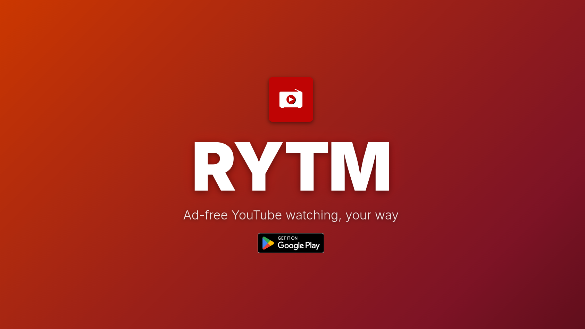
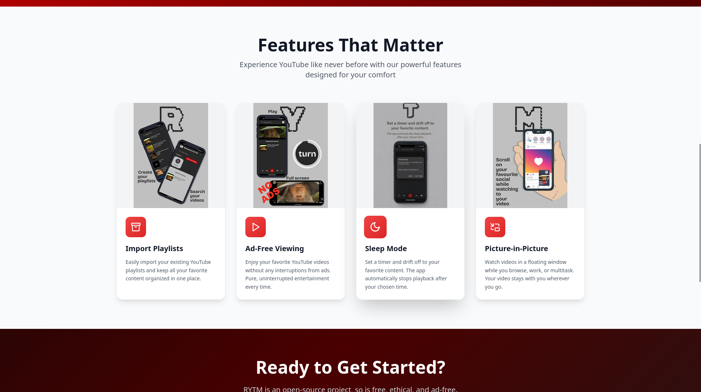

# RYTM Website

Official landing page for **Real YT Music (RYTM)** - a lightweight and feature-rich YouTube music player.

🌐 **Live Site**: [rytmapp.netlify.app](https://rytmapp.netlify.app)

## 📱 About RYTM

Real YT Music (RYTM) is a lightweight and versatile YouTube-based music app designed to enhance music discovery and playback. It integrates seamlessly with YouTube APIs, allowing you to explore, organize, and enjoy your favorite music videos in a simple and intuitive way.

**Key Features:**
- 🚫 **Ad-Free Viewing** - Watch your videos without any interruptions
- 📱 **Picture-in-Picture Mode** - Listen while scrolling through other apps
- ⏰ **Sleep Timer** - Set a timer to automatically stop playback
- 📚 **Playlist Management** - Import and organize your YouTube playlists
- 🎵 **Background Playback** - Keep your music playing with screen off

This website serves as the official landing page, showcasing the app's capabilities and providing download links.

## 🖼️ Preview

### Hero Section


### Features Showcase


## 🚀 Getting Started

### Prerequisites
- Node.js 16+ and npm

### Installation

```bash
# Clone the repository
git clone <repository-url>
cd RYTM-website

# Install dependencies
npm install

# Start development server (runs on port 3000)
npm run dev
```

### Available Scripts

```bash
npm run dev      # Start development server
npm run build    # Build for production
npm run preview  # Preview production build
npm run lint     # Run ESLint checks
```

## 🛠️ Tech Stack

- **Framework**: React 18 with Vite
- **Styling**: Tailwind CSS for utility-first styling
- **Animations**: Framer Motion for smooth, performant animations
- **UI Components**: Radix UI for accessible component primitives
- **Icons**: Lucide React for clean, consistent iconography
- **Deployment**: Netlify with continuous deployment

## 📁 Project Structure

```
RYTM-website/
├── public/
│   ├── features/          # App screenshots for feature section
│   ├── logo.png          # RYTM logo
│   └── favicon.ico       # Site favicon
├── src/
│   ├── components/       # React components
│   │   ├── Hero.jsx     # Landing hero section with animated background
│   │   ├── Features.jsx # Feature showcase with app screenshots
│   │   ├── CallToActionSection.jsx  # Download and contribution CTAs
│   │   ├── Footer.jsx   # Site footer
│   │   └── ui/          # Reusable UI components (buttons, toast, etc.)
│   ├── pages/
│   │   └── HomePage.jsx # Main page component
│   ├── lib/
│   │   └── utils.js     # Utility functions
│   ├── App.jsx          # Root application component
│   ├── main.jsx         # Application entry point
│   └── index.css        # Global styles and animations
├── index.html           # HTML template
└── package.json         # Project dependencies
```

## 🎨 Features

### Animated Gradient Backgrounds
The site features smooth, rotating gradient animations on both the hero and call-to-action sections, inspired by YouTube Music's premium aesthetic.

### Responsive Design
Fully optimized for all screen sizes, from mobile devices to large desktop displays.

### App Screenshot Integration
Real app screenshots showcased in the features section, providing users with a visual preview of RYTM's interface.

## 🤝 Contributing

Contributions are welcome! Whether it's bug fixes, feature additions, or design improvements:

1. Fork the repository
2. Create a feature branch (`git checkout -b feature/amazing-feature`)
3. Commit your changes (`git commit -m 'Add some amazing feature'`)
4. Push to the branch (`git push origin feature/amazing-feature`)
5. Open a Pull Request

Please ensure your code follows the existing style and all tests pass.

## 📋 TODO

- [x] Add actual app screenshots to feature section
- [ ] Add user testimonials section
- [ ] Implement analytics tracking
- [ ] Create documentation page
- [ ] Add language localization

## 📄 License

This project is licensed under the MIT License - see the [LICENSE](LICENSE) file for details.

## 🙏 Acknowledgments

- Built with React and modern web technologies
- Designed to complement the RYTM mobile app experience
- Hosted on Netlify for seamless deployment

---

**Built with ❤️ for music lovers who deserve an ad-free experience**